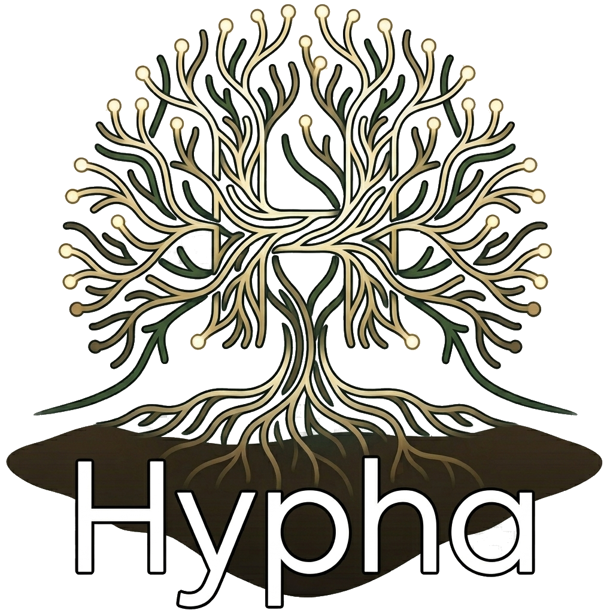
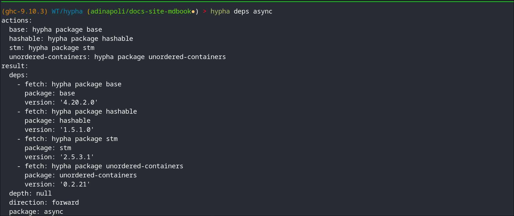
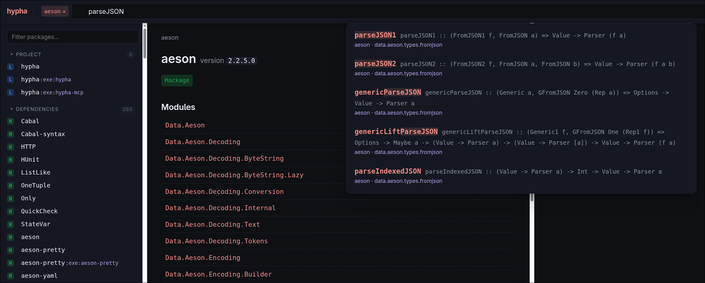

<p align="center">
  
</p>

<h1 align="center">hypha</h1>

<p align="center">
  <em>A Haskell-aware code/doc browser tuned for AI agents and humans alike.</em>
</p>

---

AI agents burn tokens fetching Hackage HTML and re-grepping the source tree
just to find a signature or a Haddock paragraph. **`hypha` makes Haskell
knowledge cheap to consume:** every command emits compact, structured
**YAML** by default (`--json` for machine pipelines) — no HTML noise — and
you can trim it further with `--select`.

It is **plan-aware**: `hypha` reads your `dist-newstyle/cache/plan.json`, so
answers reflect the exact versions you build against — including your local
project — and symbols point to the `file:line` where they are actually
defined, following a re-export through as many modules as it takes and into
another package when that is where the declaration lives. One library
powers both the CLI and a local doc-browser server, so agents and humans see
the same data.

<p align="center">
  
  &nbsp;
  
</p>

## Install

```bash
git clone https://gitlab.well-typed.com/well-typed/hypha.git
cd hypha && cabal install exe:hypha exe:hypha-mcp
```

## Try it

```bash
cd your-cabal-project && cabal build --dry-run   # writes plan.json
hypha symbol aeson/Data.Aeson/encode
```

## Development

`cabal build` uses GHC 9.10.3, which the default `cabal.project` points at. The
other supported compilers have their own project file, each with a committed
freeze that cabal picks up automatically:

```bash
cabal build all --project-file=cabal.ghc-9.6.7.project
cabal build all --project-file=cabal.ghc-9.12.4.project
```

Needs `cabal >= 3.4`: the project files are wired with `import:` rather than
symlinks, so a Windows checkout works unchanged.

## Troubleshooting

**Set a UTF-8 locale to *build* hypha.** GHC derives every `Handle`'s encoding
from the locale, so under `C`/`POSIX` — the default in bare containers, where
`LANG` is unset — `happy` cannot read `ghc-lib-parser`'s grammar:

```
happy: compiler/GHC/Parser.y: hGetContents: invalid argument (cannot decode byte sequence starting from 226)
```

Byte 226 is the first byte of the `∷` (U+2237) in the GHC 9.12 series'
`Parser.y`. Fix it by giving the build a UTF-8 locale:

```bash
export LANG=C.UTF-8
```

*Running* hypha needs no such thing: both binaries pin UTF-8 on their handles
at startup, whatever the locale.

## 📖 Documentation

The full guide — installation, subcommands, the doc-browser server, MCP
integration, caching, troubleshooting, and design — lives on the
**[hypha docs site](https://well-typed.pages.well-typed.com/hypha/)**.

## License

BSD-3-Clause. See [`LICENSE`](LICENSE).
