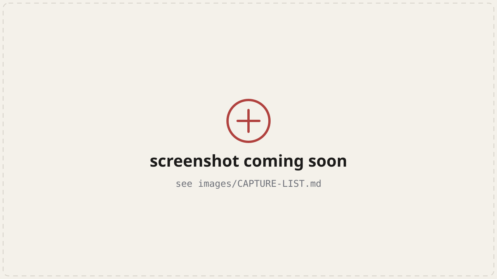

<p align="center">
  
</p>

<h1 align="center">hypha</h1>

<p align="center">
  <em>A Haskell-aware code/doc browser tuned for AI agents and humans alike.</em>
</p>

---

AI agents burn tokens fetching Hackage HTML and re-grepping the source tree
just to find a signature or a Haddock paragraph. **`hypha` makes Haskell
knowledge cheap to consume:** every command emits compact, structured
**YAML** by default (`--json` for machine pipelines) — no HTML noise — and
you can trim it further with `--select`.

It is **plan-aware**: `hypha` reads your `dist-newstyle/cache/plan.json`, so
answers reflect the exact versions you build against — including your local
project — and symbols point to the `file:line` where they are actually
defined, even across re-exports and CPP `#ifdef` branches. One library
powers both the CLI and a local doc-browser server, so agents and humans see
the same data.

<p align="center">
  
  &nbsp;
  
</p>
<!-- Swap the two placeholders for website/src/images/hero-cli.png and
     hero-server.png once captured — see website/src/images/CAPTURE-LIST.md. -->

## Install

```bash
git clone https://gitlab.well-typed.com/well-typed/hypha.git
cd hypha && cabal install exe:hypha exe:hypha-mcp
```

## Try it

```bash
cd your-cabal-project && cabal build --dry-run   # writes plan.json
hypha symbol async/Control.Concurrent.Async/concurrently
```

## 📖 Documentation

The full guide — installation, subcommands, the doc-browser server, MCP
integration, caching, troubleshooting, and design — lives on the
**[hypha docs site](https://gitlab.well-typed.com/well-typed/hypha/-/tree/main/website)**.
<!-- TODO: once GitLab Pages is enabled, point this at the Pages URL
     (e.g. https://well-typed.gitlab.io/hypha/). -->

## License

BSD-3-Clause. See [`LICENSE`](LICENSE).

---

<p align="center">
  <em>Built with <code>λ</code> by <a href="https://well-typed.com">Well-Typed LLP</a></em>
</p>
