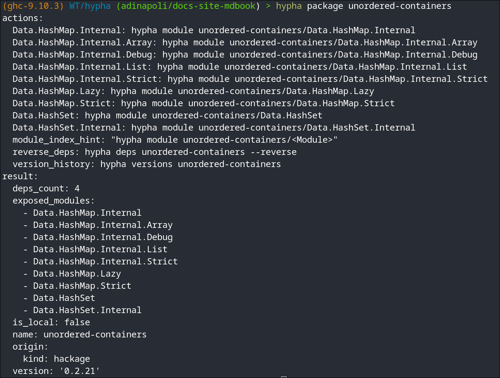

# Quick Start

## 1. Materialise a build plan

`hypha` reads `dist-newstyle/cache/plan.json` to learn which versions your
project builds against. Generate it with a dry-run build:

```bash
cd /path/to/your-cabal-project
cabal build --dry-run        # writes dist-newstyle/cache/plan.json
```

## 2. Query a symbol — compact YAML

```bash
hypha symbol aeson/Data.Aeson/encode
```

```yaml
actions:
  module_index: hypha module aeson/Data.Aeson
  package_info: hypha package aeson
  view_source: hypha source aeson/Data.Aeson/encode
result:
  haddock_raw: " Efficiently serialize a JSON value as a lazy 'L.ByteString'.\n\n This is implemented in terms of the 'ToJSON' class's 'toEncoding' method."
  kind: function
  module: Data.Aeson
  name: encode
  package: aeson
  signature: "encode :: (ToJSON a) => a -> L.ByteString"
  version: '2.2.5.0'
```

YAML is the **default** output: compact, readable in a terminal, and cheap
for an agent to parse. The top level is just `result:` (the answer) and
`actions:` (suggested follow-up commands). Keys are emitted in sorted
order, which is why `actions:` comes first — do not rely on field order,
rely on the field names.

A symbol whose definition lives in another module gains a `defined_in:`
block naming it; `encode` is declared where it is exported, so there is
none here.

<p align="center">
  
</p>

## 3. Project only the fields you need

```bash
hypha symbol async/Control.Concurrent.Async/concurrently --select signature,haddock
```

`--select` post-filters the output to the listed fields; `--full` opts into
every field. See **[Global Flags](../guide/flags.md)**.

## 4. JSON for machine pipelines

When a downstream tool wants JSON, opt in with `--json`:

```bash
hypha symbol async/Control.Concurrent.Async/concurrently --json
```

## Next steps

- Learn the **[Identifier Syntax](../guide/identifiers.md)** (`pkg`,
  `pkg-version`, module, symbol).
- Browse all **[Subcommands](../guide/subcommands.md)**.
- Use **[`hypha lookup`](../guide/lookup.md)** when you don't know which
  package provides a name or type.
