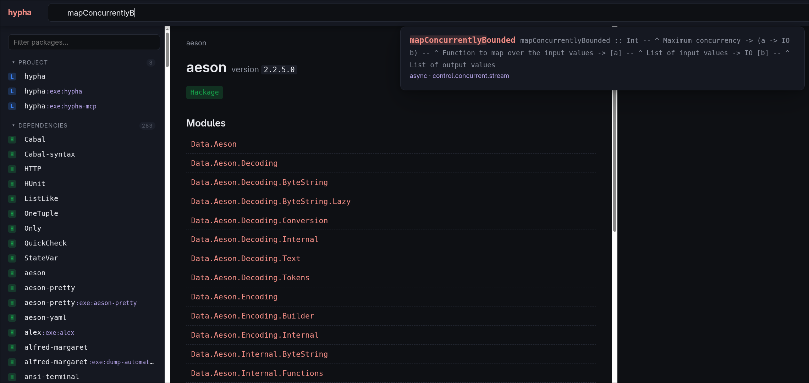
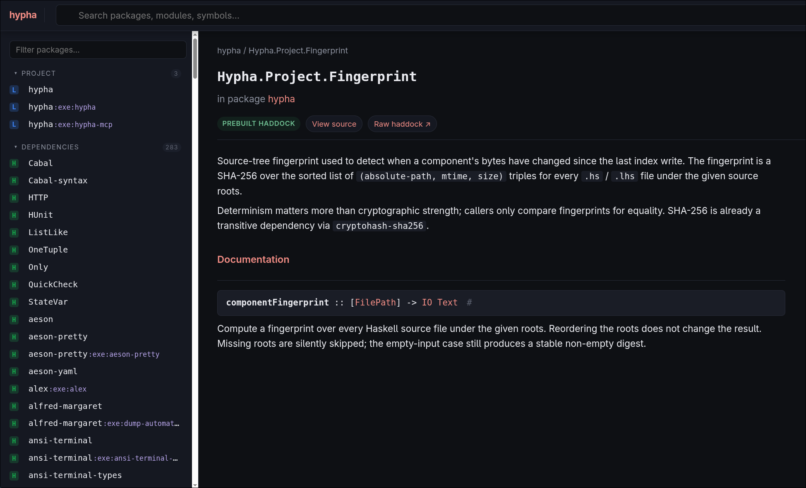
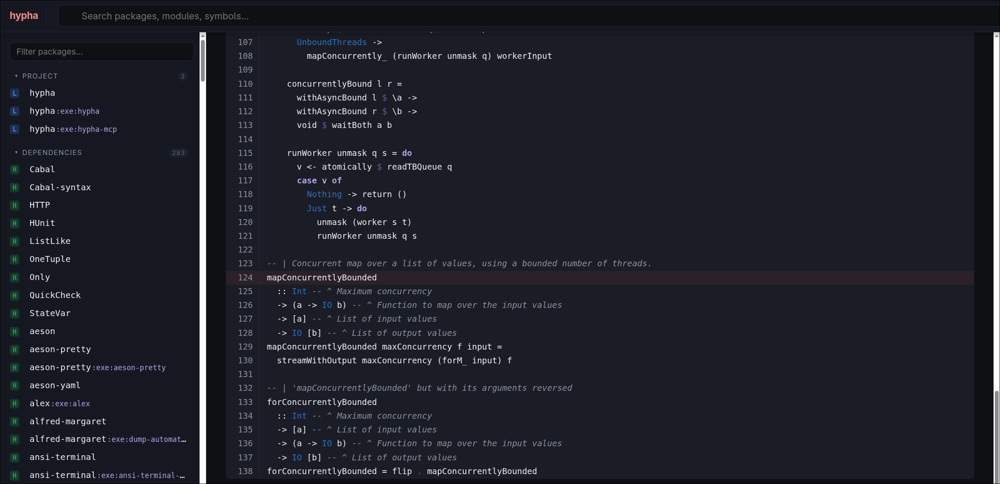

# Doc Browser Server

`hypha server` is a loopback-only doc browser built on the same data as the
CLI, but with a visual surface humans can scan quickly. The first run pays
the indexing cost; every subsequent run hits the SQLite cache and renders
results on the first keystroke.

```bash
$ hypha server --port 4287
hypha server listening on http://127.0.0.1:4287
```

<p align="center">
  
</p>
<!-- Placeholder; overwrite images/hero-server.png in place. -->

## Highlights

- **Command-palette fuzzy search.** Type `Data.Map lookup` or
  `Data.Map.Strict.lookup` — FZF/Telescope-style tokenised matching ranks
  the canonical symbol first. The dropdown is centered under the search bar
  and works the same on every page.

  <p align="center">
    
  </p>
  <!-- Placeholder; overwrite images/server-search.png in place. -->

- **Live build-progress feedback.** A slim accent-coloured progress bar at
  the top of the page shows how many packages remain to index. A shimmering
  "Building the docs…" placeholder fills the dropdown until the index is
  warm.
- **Faithful symbol cards.** Multi-line signatures are joined, Haddock prose
  is parsed and rendered to HTML (paragraphs, `<code>`, `<pre>` code blocks,
  lists, links), and the source link points at the canonical declaration —
  even when the symbol is re-exported.

  <p align="center">
    
  </p>
  <!-- Placeholder; overwrite images/server-symbol-card.png in place. -->

- **Skylighting-rendered source view** with a `?line=N` scroll target.

  <p align="center">
    
  </p>
  <!-- Placeholder; overwrite images/server-source-view.png in place. -->

- **Private libraries.** Sublibs appear as separate sidebar entries (`hypha`,
  `hypha:lib-breakdown`), each with their own pages and search scope.

See **[Endpoints & Flags](reference.md)** for the full HTTP surface and
command-line options.
